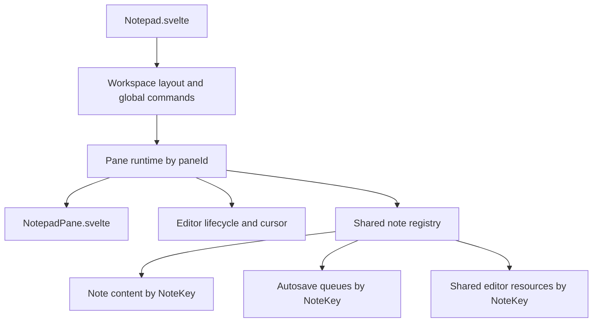

# Pane Ownership Refactor

## Goal
Move toward panes as real entities without breaking the important invariant: note content is shared by `NoteKey`, while each pane has its own editor/view/cursor state. This should reduce `Notepad.svelte` complexity and avoid a prop-heavy `NotepadPane.svelte` API.

## Current Model To Preserve
[`src/lib/features/notepad/state/noteStore.ts`](src/lib/features/notepad/state/noteStore.ts) already has the right core shape:

```ts
export interface PaneState<TPaneId extends string = string> {
  paneId: TPaneId;
  kind: 'editor' | 'chat';
  noteKey: NoteKey;
}

export interface NotepadState<TPaneId extends string = string> {
  activePaneId: TPaneId;
  panesById: Record<TPaneId, PaneState<TPaneId>>;
  notesByKey: Record<string, NoteDraftState>;
  // ...
}
```

The refactor should keep that separation. `panesById[paneId].noteKey` chooses what a pane shows; `notesByKey[noteKey]` is the shared note content.

## Target Ownership


`Notepad.svelte` should own workspace-level decisions: pane order, active pane, global keyboard routing, bottom bar, related panel, and cross-pane commands.

A pane runtime should own pane-local concerns: DOM refs, editor controller, editor ready/applying flags, cursor save timer, open request generation, wikilink autocomplete state, and calls into editor lifecycle.

A note registry/service should own note-keyed concerns: note content, rekeying, reference cleanup, shared editor resources/state generation, autosave queues/timers, and document sync frames.

## Important Design Answer
Persistence should not become purely pane-owned. A pane can trigger saves, but the save queue/timer should remain note-keyed. If two panes show the same note, duplicate pane-owned autosave queues would race. The better split is: pane runtime detects edits and requests persistence for its current `noteKey`; a note-level persistence service serializes saves by note key.

## Implementation Tasks

1. Remove proposal coupling from pane/title paths first.
   - Delete proposal title display/read-only handling from [`src/lib/features/notepad/Notepad.svelte`](src/lib/features/notepad/Notepad.svelte) if proposal state is being removed.
   - This keeps the pane ownership refactor from carrying obsolete proposal decisions into new APIs.

2. Introduce a note-keyed runtime module.
   - Create a small module such as [`src/lib/features/notepad/session/noteRuntime.ts`](src/lib/features/notepad/session/noteRuntime.ts).
   - Move note-keyed maps out of `Notepad.svelte`/runtime callsites behind functions:
     - `sharedEditorResourcesByNoteKey`
     - `sharedEditorStateByNoteKey`
     - `sharedEditorStateGenerationByNoteKey`
     - `noteSaveTimers`
     - `noteSaveQueues`
     - `documentSyncFrameIds`
   - Keep existing behavior for `transferNoteRuntime(oldKey, nextKey)` and `cleanupNoteRuntime(noteKey)`.

3. Introduce a pane runtime model.
   - Create a module such as [`src/lib/features/notepad/pane/paneRuntime.svelte.ts`](src/lib/features/notepad/pane/paneRuntime.svelte.ts).
   - Move pane-local state from `Notepad.svelte` into one runtime per pane:
     - `isEditorReady`
     - `isApplyingExternalContent`
     - `editorGeneration`
     - `slashMenu`
     - `wikilinkAutocomplete`
     - DOM refs: pane card, editor shell/root, title input/shell
     - editor controller
     - cursor save timer
     - open request generation
   - Expose simple methods like `mountEditor()`, `unmountEditor()`, `saveCursor()`, `focus()`, and `setNoteKey()`.

4. Rewire editor lifecycle through pane runtime.
   - Keep [`src/lib/features/notepad/editor/editorLifecycleController.ts`](src/lib/features/notepad/editor/editorLifecycleController.ts), but instantiate it inside/through the pane runtime instead of assembling all dependencies in `Notepad.svelte`.
   - The lifecycle should read the pane’s current note via `pane.noteKey -> notesByKey[noteKey]`.
   - It should write shared editor snapshots/resources through the note runtime, not directly through parent-owned maps.

5. Rework note edit flow around shared note updates.
   - Replace parent-level `handleEditorMarkdownChange(paneId, document, ...)` with a pane-runtime callback that updates `notesByKey[noteKey]` and then requests note-keyed autosave.
   - When one pane edits a shared note, schedule a note-keyed document sync so sibling panes showing the same `noteKey` receive the update.
   - Keep editor snapshots/generation note-keyed so the latest editing pane can be used as the source of truth.

6. Move pane-local UI wiring into `NotepadPane.svelte` gradually.
   - Change `NotepadPane.svelte` from many primitive props to a single `pane`/`paneViewModel` prop and a small `workspaceActions` prop.
   - Bind refs directly into the pane runtime instead of separate parent variables.
   - Keep `NotepadPane.svelte` visual: it should call pane/runtime methods, not own note save policy or cross-pane layout.

7. Keep workspace operations in `Notepad.svelte` until they are small enough to extract.
   - Keep split/close/activate orchestration in `Notepad.svelte` initially because these change pane order and note references.
   - Update those operations to call pane runtime methods instead of manipulating editor controllers/refs directly.
   - Later, extract a `workspaceController` only if the reduced `Notepad.svelte` still has clear duplicated orchestration.

8. Add focused tests around invariants.
   - Extend tests near [`src/lib/features/notepad/state/noteStore.ts`](src/lib/features/notepad/state/noteStore.ts) or add a new pane runtime test file.
   - Cover: two panes can reference one note key, edits update shared note content, closing one pane does not delete a still-referenced note, rekeying transfers note runtime, and autosave remains serialized by note key.

## Feature Parity Checks
- Opening a note in one pane updates only that pane’s `noteKey` unless intentionally sharing.
- Choosing “current note” in split picker makes both panes reference the same `noteKey`.
- Editing shared content in one pane updates the shared note and syncs the sibling pane editor.
- Each pane keeps independent cursor position by `paneId`.
- Autosave still queues by `noteKey`, not by pane.
- Closing a pane cleans pane runtime but does not clean shared note runtime while another pane references the note.
- Slash menu and wikilink autocomplete remain pane-local.
- `npm run check`, Svelte autofixer, and focused tests pass after each phase.

## Migration Strategy
Do this in phases, not as one large rewrite:

1. First isolate note-keyed runtime maps behind functions with no behavior change.
2. Then introduce pane runtimes while keeping `Notepad.svelte` as the orchestrator.
3. Then simplify `NotepadPane.svelte` props to consume pane runtime/view model.
4. Only after that, consider extracting workspace orchestration if the remaining code is still too large.