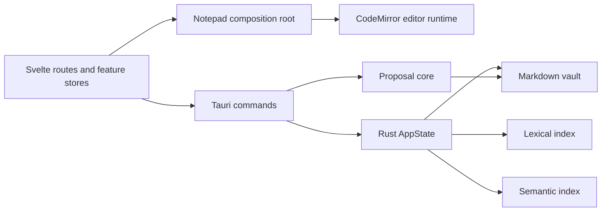

# Gneauxghts Architecture Guide

This guide is the quick map for understanding the app after the AI inbox
cleanup and editor/semantic hardening pass. It describes the current layers,
where features plug in, and which seams future work should use.

## System Overview

Gneauxghts is a Tauri app with a Svelte frontend and a Rust backend.

- Frontend: Svelte 5, CodeMirror editor, feature stores, route pages.
- Backend: Tauri commands, markdown vault persistence, lexical search,
  semantic indexing, task projection, file watching, proposal application.
- Durable user data: markdown files in the active vault.
- Vault-local app data: `<vault>/.gneauxghts`, including SQLite state and
  semantic index data.
- Global app data: model/runtime cache and app-wide configuration.

The core runtime shape is:

## Frontend Layers

### App Store

`src/lib/app/appStore.svelte.ts` is the cross-feature frontend state hub. It
bootstraps once, stores vault and semantic snapshots, and fans out backend
events:

- `vault-note-changed`
- `semantic-status-changed`
- `note-saved`
- `vault-changed`

Feature stores should subscribe through `appStore` instead of opening their own
Tauri event listeners when possible.

### Notepad Composition

`src/lib/features/notepad/Notepad.svelte` remains the composition root for the
main editor workspace. It wires together:

- pane runtimes and editor lifecycle controllers;
- document/session state;
- autosave and refresh controllers;
- search and related-note stores;
- wikilink autocomplete;
- workspace layout and split panes;
- bottom bar actions.

The component should remain a composition root, not the place where new feature
policy accumulates. New features should use the seams below.

### Notepad Feature Host

`src/lib/features/notepad/host.ts` defines the stable contract future features
should depend on. It exposes snapshots and editor/document operations without
leaking `notepadState`, pane runtimes, or raw CodeMirror `EditorView`.

Use this for future AI chat, AI inbox, or manual batch tools that need:

- active document snapshots;
- editor snapshots and selection snapshots;
- focus, save, refresh, and markdown replacement.

`Notepad.svelte` now instantiates the concrete host with
`createNotepadFeatureHost`, and related-note retrieval reads active document
context through that host.

### Editor Capabilities

`src/lib/features/notepad/editor/editorCapabilities.ts` wraps the CodeMirror
controller behind a narrower feature adapter. It exposes selected text, current
block, editor snapshot, controlled document replacement, and disposable
read-only overlays.

Feature code should depend on this adapter or the notepad feature host rather
than importing CodeMirror primitives directly.

### Notepad Commands

`src/lib/features/notepad/orchestration/notepadCommands.ts` is still the public
facade used by `Notepad.svelte`. Its dependencies are grouped through
`notepadCommandFacades.ts`, and pane activation/focus is extracted into
`paneCommandGroup.ts`.

Current command responsibility groups:

- workspace/pane: split, close, switch, activate;
- document lifecycle: open, clear, forget, restore, remember;
- derived views: search, recent notes/tasks, related notes;
- persistence/refresh: save queues, disk refresh, autosave invalidation.

Future command work should continue extracting command groups behind the same
facade rather than changing every `Notepad.svelte` call site.

### Editor Runtime

`src/lib/features/notepad/editor/editor.ts` owns the CodeMirror runtime. It is
large because it handles shared root state, pane views, command dispatch,
selection, markdown rendering, block handles, passive tables, and link opening.

Markdown rendering itself is split under `src/lib/features/notepad/markdown`:

- `markdownLanguage.ts`: CodeMirror markdown language config;
- `markdownHighlight.ts`: fenced-code highlighting;
- `markdownExtensions.ts`: combined markdown rendering extension;
- `decorations/*`: headings, lists, links, code blocks, blockquotes, inline
  formatting, and horizontal rules.

Future features should not import CodeMirror internals directly. Add editor
capabilities through the notepad feature host or a focused editor adapter.

## Backend Layers

### Tauri Startup

`src-tauri/src/lib.rs` builds the Tauri app, initializes app/vault data, creates
`SemanticState`, manages `AppState`, starts the vault watcher in the background,
and registers commands.

Startup also prewarms the notes index after the watcher is attached so early
note switches do not pay a full vault scan on the hot path.

### App State and Indexing

`src-tauri/src/index.rs` owns the backend runtime aggregate:

- in-memory `NotesIndex`;
- lexical search index;
- semantic state;
- current-draft body cache;
- background save-side index queue;
- foreground activity guard used to keep note switching responsive.

`src-tauri/src/services/background_index_queue.rs` handles save-side lexical and
task-projection work after the file has already been written.

### Commands

`src-tauri/src/commands.rs` and `src-tauri/src/commands/*` expose frontend IPC.
Important command groups:

- note/session persistence: open, read, save, remember;
- search: recent notes, recent focus, lexical/hybrid search, related notes;
- tasks: list/toggle/hide/delete task projection records;
- forgotten notes: forget/restore/delete;
- proposals: backend-authoritative note change application;
- settings/semantic: semantic config, status, debug, rebuild/pause/resume.

Existing command names for search and related notes are stable and should stay
stable unless a feature intentionally changes the IPC contract.

### Semantic Indexing

`src-tauri/src/semantic` is the local semantic subsystem:

- `mod.rs`: public `SemanticState`, settings, status, queueing, and retrieval
  entry points;
- `indexer.rs`: background index worker;
- `chunking.rs`: markdown-to-chunks;
- `embed.rs`: local embedding runtime/model management;
- `db.rs`: SQLite schema and persistence;
- `ann.rs`: ANN/HNSW index state;
- `related.rs`: related-note retrieval and cache;
- `debug.rs`: metrics and recent events.

Semantic indexing is core, but not a hard dependency. The app should keep the
editor and lexical search usable when semantic is disabled, unsupported, or
warming up.

### Current Document Resolution

`src-tauri/src/services/current_document.rs` centralizes the current draft body
resolution used by search and related notes. It preserves the existing body
hash/cache behavior while giving future retrieval/chat code a single path for
current-document context.

### Retrieval Context

`retrieve_note_context` is the neutral backend command for context packs. It
uses current-document resolution, supports `note`, `selection`, and `query`
scopes, and returns items with source, reason, score, lexical score, semantic
score, and line metadata.

Use this for future chat/inbox context instead of adapting search UI results or
related-note cards.

### Proposal Core

`src-tauri/src/proposals.rs` defines source-agnostic note changes:

- `updateNote`;
- `createNote`;
- `deleteNote`.

Rust validates update/delete content hashes before writing. Validation happens
before any write within a single invoke, so invalid change sets do not partially
apply. Callers send the accepted subset (often one change for Keep, or all
pending for Keep all). The command `apply_note_change_proposal` applies the
change set and updates lexical, in-memory, and semantic indexes.
`hash_markdown_content` exposes the same blake3 hash used for OCC.

Frontend mirror types live in `src/lib/types/proposals.ts`. The review UX lives
in `src/lib/features/proposals/`: a shared review session, line-diff model,
chat `ProposedChangesCard`, and CodeMirror decoration-based inline review.
Backend Rust remains authoritative for validation and file mutation.

## Core Feature Flows

### Edit and Save

1. User edits markdown in CodeMirror.
2. Editor lifecycle routes markdown changes into the active `NoteDraftState`.
3. Autosave uses note persistence commands.
4. Rust writes markdown to disk and updates app state/recents.
5. Save-side indexing updates in-memory notes immediately and queues lexical,
   task, and semantic work.
6. Backend emits events; frontend app/notepad stores refresh derived views.

### Search

1. Frontend search store calls `search_notes_hybrid`.
2. Rust validates current path and resolves current draft body through
   `current_document`.
3. Lexical candidates are collected from the in-memory/lexical index.
4. Semantic matches are added when settings and query shape allow it.
5. Results are merged, scored, cached briefly, and returned.

### Related Notes

1. Frontend related store reads active document context through
   `NotepadFeatureHost`.
2. Frontend related store sends current note or selected text.
3. Rust resolves current draft body through `current_document`.
4. `SemanticState::related_notes` checks semantic availability and content
   sufficiency.
5. Related results are returned with explicit unavailable/insufficient-content
   states when semantic cannot run.

### Retrieval Context

1. Frontend callers use `retrieveNoteContext` with `note`, `selection`, or
   `query` scope.
2. Rust resolves current draft body through `current_document`.
3. Query scope merges lexical and semantic matches.
4. Note and selection scopes reuse related-note retrieval behavior.
5. Results are returned in a UI-neutral context-pack shape.

### Proposal Apply

1. A producer (make-mode `gneauxghts-proposal` fence, or the fixture loader)
   loads `NoteChange[]` into the review session with base markdown for diffs.
2. Chat shows the proposed file list; opening a row enters inline review in an
   editor pane (unified red/green diff).
3. Keep calls `apply_note_change_proposal` with that change (or Keep all with
   the pending subset). Undo drops the change client-side.
4. Rust validates paths and content hashes, then applies writes/deletes and
   updates lexical, in-memory, and semantic indexes.
5. Frontend exits review mode and refreshes the open note from disk.

## Extension Rules

- New editor-aware features should depend on the notepad feature host, not
  `Notepad.svelte`, pane runtimes, or CodeMirror directly.
- New context-aware features should depend on semantic retrieval services, not
  ANN/SQLite/embedding internals.
- New note-mutating features should produce neutral note changes and use the
  proposal core.
- New cross-feature event consumers should subscribe through `appStore` when
  possible.
- `Notepad.svelte` should wire features together; it should not absorb new
  business logic.
