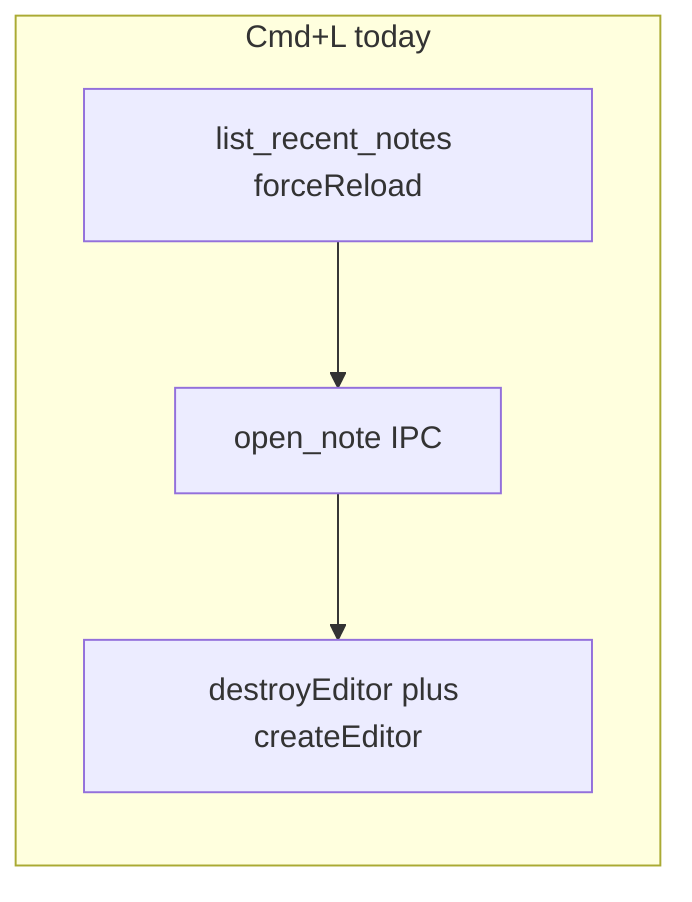

# Faster note switching

## What we learned (constraints)

- **`forceReload: true`** on [`Notepad.svelte`](src/lib/features/notepad/Notepad.svelte) forces [`getIndexedRecentItem`](src/lib/features/notepad/search/recent.ts) to always call `refreshRecentNotesNow()` → Tauri **`list_recent_notes`**, which always does state I/O, `ensure_interactive_index`, and an index lock ([`search_commands.rs`](src-tauri/src/commands/search_commands.rs)) even when the client already has a valid `[0]` recent.
- **`open_note`** remains necessary: disk read + session ([`note_session.rs`](src-tauri/src/commands/note_session.rs)).
- **Full destroy/recreate** in [`replaceNoteAcrossPanes`](src/lib/features/notepad/Notepad.svelte) via [`editorLifecycleController.replaceEditorContent`](src/lib/features/notepad/editor/editorLifecycleController.ts) is required when **the note key changes**, because [`createEditor`](src/lib/features/notepad/editor/editorLifecycleController.ts) binds `sharedResources: getSharedEditorResources(document)` to that note’s [`FileEditorRuntime`](src/lib/features/notepad/editor/editor.ts). Applying another note’s markdown in-place on the old controller would target the **wrong** runtime.

## Phase 1 — Quick win: stop forcing recents refresh on ⌘L

**Change:** In [`Notepad.svelte`](src/lib/features/notepad/Notepad.svelte), change the `goToPreviousNote` handler from `openRecentNoteByIndex(0, { forceReload: true })` to **`openRecentNoteByIndex(0)`** (or `{ forceReload: false }` explicitly).

**Behavior:** [`getIndexedRecentItem`](src/lib/features/notepad/search/recent.ts) still refreshes if `recentNotes[0]` is missing, so first-use / empty cache stays correct.

**Verify manually:** ⌘L with populated recents (no extra `list_recent_notes` when index 0 exists); empty recents / cold start still safe.

## Phase 2 — Safe editor fast path: same note key only

**Change:** In [`replaceNoteAcrossPanes`](src/lib/features/notepad/Notepad.svelte) (local function), when `previousNote.key === nextNote.key` and the pane has a controller, call **`replaceEditorContentInPlaceForDocument`** (already exposed on the lifecycle controller) with `nextNote.bodyMarkdown` and `nextNote`, instead of **`replaceEditorContent`**.

**Rationale:** Same `noteKey` implies the same [`getSharedEditorResources`](src/lib/features/notepad/editor/editorLifecycleController.ts) bucket; in-place buffer replace + `flushHistory: true` matches the existing fallback pattern in [`replaceEditorContentInPlaceForDocument`](src/lib/features/notepad/editor/editorLifecycleController.ts).

**Edge cases to handle in implementation:**

- If `replaceEditorContentInPlaceForDocument` is not available on the controller API surface from `Notepad.svelte`, thread the same logic: today `replaceNoteAcrossPanes` only calls `replaceEditorContent`; confirm the lifecycle controller exports `replaceEditorContentInPlaceForDocument` (it does at line ~282) and is reachable from `paneControllers[paneId]`.
- Keep existing branches: non-editor panes, missing controller (`markPaneDocumentGeneration`), `cleanupNoteRuntime` unchanged.

**Tests (light):** If you have or add a small harness around search store + open flow, optional; otherwise manual QA for “reload same note from disk” / remember flows that hit `replaceNoteAcrossPanes` with same key ([`Notepad.svelte`](src/lib/features/notepad/Notepad.svelte) call sites ~1308, ~1384, refresh controller).

## Phase 3 — Optional / follow-up (not required for first PR)

Pick based on profiling after Phases 1–2:

1. **Rust — `list_recent_notes`:** Avoid redundant `write_state` when `prune_recent_note_ids` made no changes (micro-optimization; read code paths in [`search_commands.rs`](src-tauri/src/commands/search_commands.rs) + [`state`](src-tauri/src/state) helpers). Only worth it if traces show state I/O as hot.
2. **UI thread — related drawer:** [`scheduleRelatedIfNeeded({ immediate: true })`](src/lib/features/notepad/Notepad.svelte) after open; consider `requestAnimationFrame` or dropping `immediate` on note open so related work does not overlap the critical path (only if related panel is often open).
3. **Large initiative (separate plan):** Cross-note **editor reuse** would require a new lifecycle API (e.g. rebind controller to `getSharedEditorResources(nextNote)` or per-pane runtime) so markdown can swap without `destroyEditor` + `createEditor`. That touches [`editor.ts`](src/lib/features/notepad/editor/editor.ts), [`editorLifecycleController.ts`](src/lib/features/notepad/editor/editorLifecycleController.ts), and possibly wikilink/image runtime — out of scope for the first pass.

## Success criteria

- ⌘L feels snappier when recents are already loaded (one fewer awaited IPC round-trip before `open_note`).
- Same-key transitions (refresh-type flows) avoid full CodeMirror teardown when safe.
- No regression: switching between **different** notes still uses destroy+create until Phase 3 exists.
