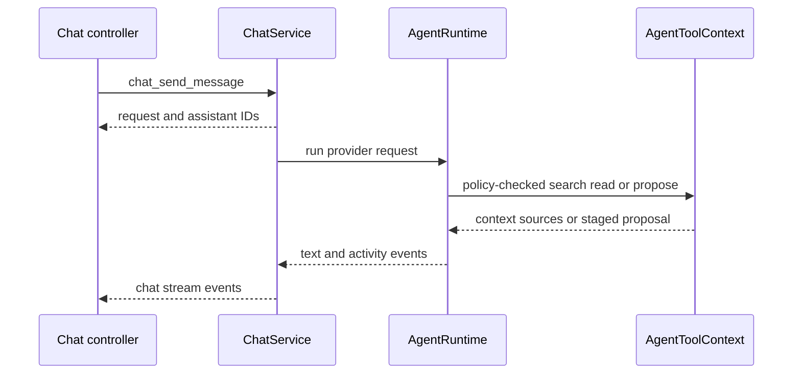
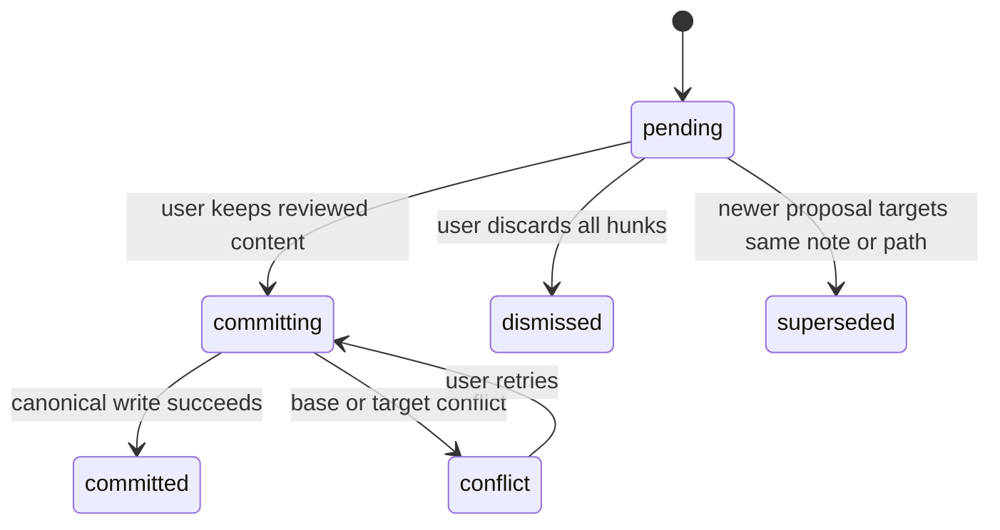

# Thought partner and reviewed writes

The thought partner is a Rust-owned provider/tool runtime with Svelte adapters and UI. `ChatService` in `src-tauri/src/chat.rs` owns vault-local `ai.sqlite3`: settings, conversations/messages/attachments, policies/grants, runs/events, sources, excerpts, and durable proposal state. It initializes schema when managed at startup and recovers abandoned streaming/running requests as cancelled. `recover_agent_proposal_commits` also examines interrupted commit intents at startup: it marks an intent committed only when exact filesystem proof matches the intended content/hash; it does not replay a proposal into the vault. This data is portable with the vault; keys are not.

## Providers and secrets

Only `openai` and `local` are accepted; legacy `ollama` normalizes to local. Configuration precedence is: persisted chat settings, then built-in defaults for provider/model/local endpoint; the selected provider determines key lookup and endpoint, while debug-only environment overrides are an explicit runtime input rather than a cross-provider fallback. `agent_runtime.rs` uses Rig OpenAI client for OpenAI and an OpenAI-compatible client at configured `localBaseUrl` for local. Local requires desktop, validates HTTP(S), rejects credentials/query/fragments, and permits HTTP only for localhost addresses. Local never enables hosted web search; selection does not fall back to OpenAI. OpenAI key absence and local endpoint/setup failures return errors. The title-refinement helper has a narrow fallback to the note title only; it is not provider substitution. Runtime helper/configuration tests cover parsing and URL policy, but live provider failure/no-fallback integration is a coverage gap.

`secrets.rs` stores provider keys using Tauri keyring accounts, exposing only configured status and set-key commands to frontend. On macOS status lookup is metadata-only. Debug builds can use provider environment overrides. The Tauri WebView has no filesystem permission; provider traffic is Rust `reqwest` and not constrained by WebView CSP. `capabilities/default.json` still grants default core/plugin capabilities to the main window, rather than per-command policy.

## Access policy and authoritative context

Conversation `VaultAccess` is `none`, `approved`, or `full`. `note_is_allowed` always denies excluded stable IDs; then none denies, full allows, approved requires a grant. Policy/exclusion changes cancel active requests. AI exclusions apply to AI lexical/semantic retrieval, citation sources, and proposal targets, not user search/atlas.

Agent history includes up to 16 complete user/assistant messages. Active-note snapshots may be persisted for retry, but `AgentToolContext` rereads authoritative disk content, checks stable ID, policy and catalog resolution; it caps body at 48,000 chars. Explicit wikilinks are resolved locally and policy-filtered. This makes UI body non-authoritative but is also a local data-retention consideration because snapshot body can live in `ai.sqlite3`.

## Streaming, tools, citations, and attachments

`begin_request` validates state/content/attachments, persists user message, streaming assistant placeholder and run, returns IDs, and spawns `run_request`. Cancellation uses `CancellationToken`; events have per-run sequence numbers and TS drops duplicate/out-of-order agent envelopes. Text accumulates directly in assistant message content; non-text agent events persist. Raw provider reasoning/events are suppressed, leaving generic lifecycle only.

Tools are `get_active_note`, `search_notes`, `read_note`, three no-write proposal tools, and `update_plan`. Read/search honor policy; update/rewrite proposals must target an allowed note surfaced during this run, verify expected content hash, and combine pending proposal working content. Exclusion is persisted by `chat_set_note_excluded` without deleting Markdown; retrieval, agent search, proposal targets, and historical citations filter the excluded stable-ID set. Semantic self-exclusion (a note omitted from its own related-neighbor computation) is distinct from policy exclusion (a note hidden from AI context). The citation-filtering and newly-excluded-note tests are the focused privacy evidence. Sources are message-level note excerpts with stable IDs/path/anchor. Web “citations” are URLs heuristically extracted from model text, not structured provider provenance; neither system proves claim-to-source alignment.

Frontend validates max 10 attachments, 10 MiB each, 25 MiB total, capability and MIME; Rust revalidates base64 size/count/kind, decoded length, UTF-8 text and allowed type. Attachments persist base64 in `ai.sqlite3` and re-enter bounded history. MIME is not magic-byte validation and capability reporting is static prefix logic, not model discovery.

## Reviewed proposal lifecycle

Proposals have `pending`, `committing`, `committed`, `conflict`, `dismissed`, `superseded`. Tool calls only stage durable previews and emit `chat://proposal`; they never write notes. UI review loads a clean-baseline editor, lets user keep/undo hunks, suppresses generic autosave, then calls commit with reviewed markdown or dismisses. Rust rechecks proposal status/policy/base hash, computes plan, records commit intent, writes canonical content, marks result, and invokes post-commit index synchronization. The prepare/begin/commit/resolve protocol records the expected visible-content hash before mutation; a changed base returns a conflict and does not mark the proposal committed. Update edits require exact expected content plus anchor checks for insert/append/prepend/replace; create proposals reject an occupied target. Keep is the explicit commit, Undo/dismissal resolves without a note write, and status-write or filesystem failures remain recoverable/degraded rather than being reported as success. Create proposals are allowed under approved/full (only none blocks them). The focused evidence includes `plan_agent_update_commit`, `commit_agent_proposal`, repeated-insert safety, create-collision, mismatch recovery, and proposal review-machine tests.

## Tests and gaps

TS tests cover API shape, controller reconciliation, agent-event sequencing, attachments, configuration and review state machine; Rust tests cover secrets, URL policy, runtime helpers, attachment/policy/schema behaviors. No observed live-provider or local-server integration, keyring integration, structured web-citation provenance, malformed allowlisted binary security test, or full durable proposal crash-recovery integration. Unit/startup evidence does cover `startup_recovers_canonical_write_after_status_update_was_missed`, `proposal_commit_mismatch_recovery`, and filesystem-proof `recover_agent_proposal_commits`; these establish bounded recovery decisions, not every crash point. Use `pnpm test -- src/lib/features/chat` and `cargo test --manifest-path src-tauri/Cargo.toml chat`; consult [IPC and events](../architecture/ipc-events-contract.md) for registered commands and [document workspace](../notepad/document-workspace.md) for editor review coordination.