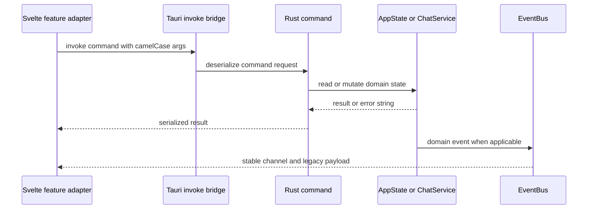

# Tauri IPC and events

`src-tauri/src/lib.rs` is the registration authority: every callable command is named in `tauri::generate_handler!`. Rust command modules are implementations, not automatically public. Frontend callers use `invoke` adapters/stores; event channels are emitted by typed `EventBus` in `src-tauri/src/app/events.rs`.

This is the command and notification boundary; no event delivery failure fails an already-completed command.

## Contract owners

| Surface | Rust owner | Frontend consumer |
| --- | --- | --- |
| Bootstrap/vault/note/tasks/semantic commands | `commands.rs`, submodules in `commands/` | session adapters, task stores, settings loaders |
| Search/related/retrieval | `commands/search_commands.rs`, `atlas_commands.rs` | notepad search/related and atlas store |
| Chat and provider settings | `commands/chat_commands.rs` | `features/chat/api.ts` and settings |
| Proposal mutation | `commands/proposal_commands.rs` | `TauriChatApi`, proposal orchestration |
| App events | `app/events.rs` | `appStore.svelte.ts`; chat adapter separately listens to `chat://*` |

`AppEvent` maps typed variants to stable names: `vault-note-changed`, `semantic-status-changed`, `note-saved`, `vault-changed`, and `chat://projection-conflict`. `legacy_payload()` intentionally preserves the camelCase payload shape expected by existing listeners. `AppStore` fans the four non-chat channels to subscribers rather than each feature adding a Tauri listener.

## Compatibility evidence

Rust owns versioned fixtures at `src-tauri/test-fixtures/contracts/command-payloads.json` and `app-events.json`. `src/lib/contracts/ipcFixtures.test.ts` pins high-value argument names and result shapes for `save_note`, session clear, dirty-task preparation, chat send, proposal commit, semantic status/settings and event payload compatibility. `app/events.rs` also tests its payload fixture. These fixtures do **not** enumerate every registered command; registration in `lib.rs` remains the complete inventory.

## Safe extension procedure

1. Put domain logic behind the appropriate Rust service/state owner; do not put persistence policy in a UI adapter.
2. Add a `#[tauri::command]` handler in the relevant command module and add it to `generate_handler!` in `src-tauri/src/lib.rs`.
3. Add/update the narrow frontend adapter (`session/session.ts`, `features/chat/api.ts`, or feature store), keeping Rust serde camelCase argument names exact.
4. For a cross-feature notification, add a typed `AppEvent` variant/channel and stable legacy payload in `app/events.rs`; update `appStore` only if it is an app-level event.
5. Update a contract fixture when the surface is high-value or already fixture-pinned; update both Rust and TS contract tests. Add a focused consumer test.
6. Run `pnpm test -- src/lib/contracts/ipcFixtures.test.ts`, relevant feature tests, and `cargo test --manifest-path src-tauri/Cargo.toml`.

Changing a payload field, channel, command name, or argument spelling is a breaking compatibility change unless all consumers and fixtures move together. Commands return `Result<_, String>`; expose domain failures clearly rather than silently treating partial mutation as success. Canonical note saves are the deliberate exception: a committed file can return a `commitWarning` for degraded derived projections; see [vault persistence](../vault/persistence-and-recovery.md).