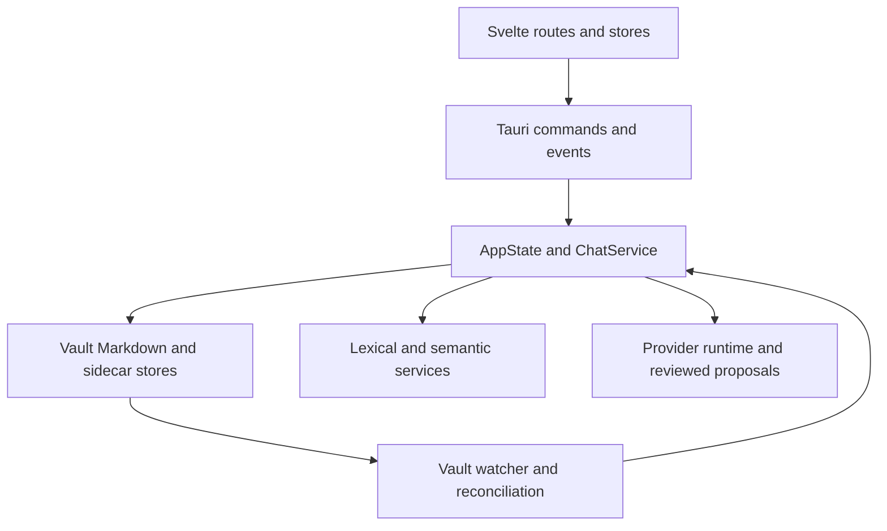

# Architecture

Gneauxghts is a single-window Tauri 2 application: SvelteKit/Svelte 5 renders the desktop UI, while Rust owns vault files, SQLite stores, indexing, watching, provider I/O, and Tauri commands. The main screen is the editor; `/list`, `/map`, and `/settings` are task, atlas, and settings screens. `src/routes/+layout.svelte` mounts theme/mobile shell and bootstraps `appStore`; `/src/routes/+page.svelte` mounts `Notepad.svelte`.

This shows the authoritative runtime boundaries.

## Startup and ownership

`src-tauri/src/lib.rs:run` initializes app/documents paths, scaffolds `<vault>/.gneauxghts`, builds `SemanticState`, `AppState`, and `ChatService`, then starts the watcher, forgotten-item cleanup, and catalog prewarm on a background thread. It installs dialog, opener, process, keyring, and desktop window-state plugins. The `generate_handler!` list is the public backend surface; see [IPC and events](ipc-events-contract.md).

| Owner | Canonical code | State it owns |
| --- | --- | --- |
| App shell | `src/routes/+layout.svelte`, `src/lib/app/appStore.svelte.ts` | cross-feature vault/semantic snapshots and four event subscriptions |
| Notepad | `src/lib/features/notepad/Notepad.svelte` | composition only; focused controllers own policy/state |
| Workspace | `workspace/workspaceStore.svelte.ts` | pane order, active pane, pane-to-note and chat references |
| Document | `document/documentState.ts`, `documentRuntime.ts` | editable buffer/baseline, operation tokens, shared editor and save queue |
| Rust app | `src-tauri/src/index.rs`, `state/*` | catalog, app state, task projection, canonical persistence |
| Retrieval | `lexical.rs`, `semantic/*` | RAM lexical index, vault-local semantic DB/artifacts and work queue |
| Thought partner | `chat.rs`, `agent_runtime.rs`, `agent_tools.rs` | chats, policies, provider execution, sources and staged proposals |

## Canonical versus derived data

Markdown files are canonical note bytes. The vault-local manifest and state databases travel with a vault, but lexical search is RAM-only and semantic HNSW/atlas artifacts are rebuildable accelerators. Chat records and unresolved proposals are persisted in vault-local `ai.sqlite3`; provider keys are machine keyring entries, not vault files. [Vault persistence](../vault/persistence-and-recovery.md), [search and atlas](../search/semantic-and-atlas.md), and [thought partner](../ai/thought-partner.md) define the precise boundaries.

## Route and lifecycle map

`NavBar.svelte` and application navigation route to `/`, `/list`, `/map`, `/settings`. The shell reports user activity at most every two seconds via `report_user_activity`, allowing semantic background work to yield to foreground usage. `appStore.bootstrap()` calls `bootstrap_app`, records vault/semantic/index snapshots, then attaches listeners; individual features retain fallback loads if bootstrap fails.

The desktop configuration in `src-tauri/tauri.conf.json` creates one 1200×800 window, uses a restrictive WebView CSP, and disables native drag/drop. Provider HTTP occurs in Rust, not through the WebView CSP.

## Change boundaries

- Change user editing, pane behavior, conflicts, or autosave in [document workspace](../notepad/document-workspace.md).
- Change Markdown persistence, paths, watcher behavior, recovery, or tasks at the file boundary in [vault persistence](../vault/persistence-and-recovery.md) and [tasks and navigation](../tasks-and-navigation.md).
- Change a command/event only through [IPC and events](ipc-events-contract.md).
- Change search, embeddings, related notes, or the map in [search and atlas](../search/semantic-and-atlas.md).
- Change provider behavior, policy, attachments, or AI writes in [thought partner](../ai/thought-partner.md).

Focused architectural ownership regression: `cargo test --manifest-path src-tauri/Cargo.toml architecture_fitness`. Full developer workflow is [operations](../operations/development-and-testing.md).