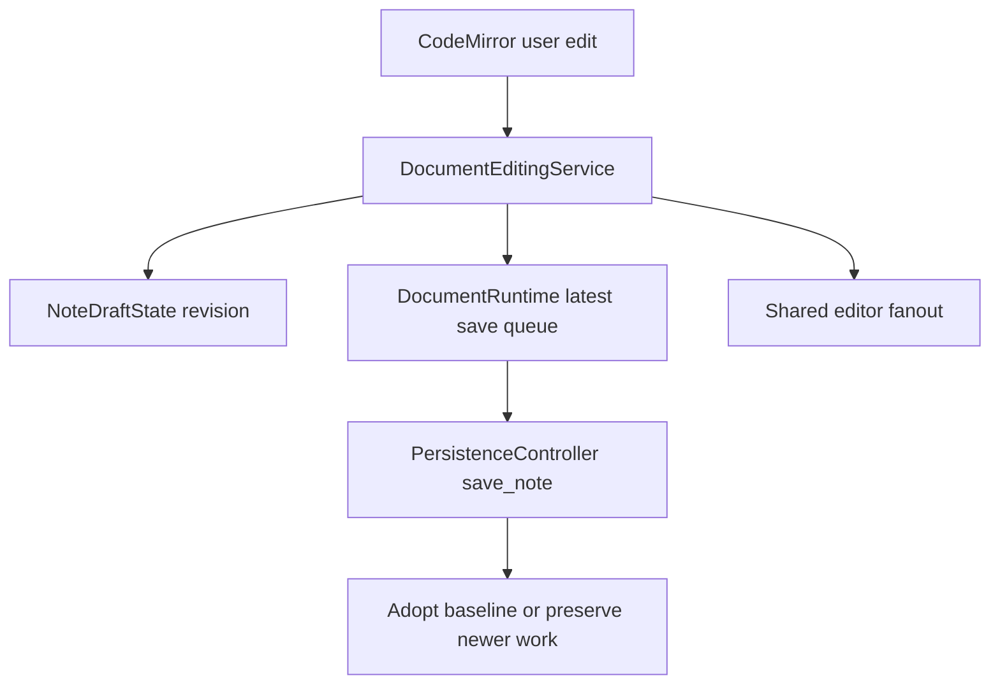
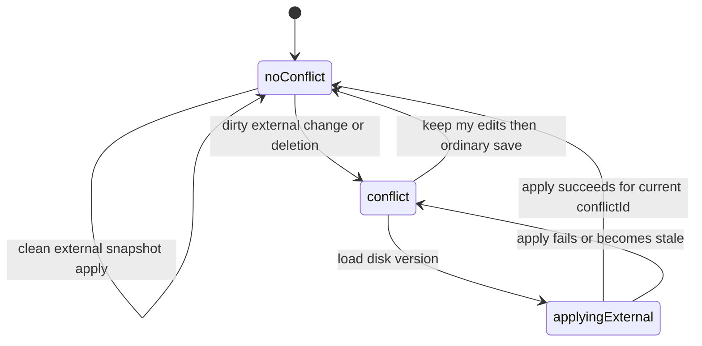

# Document workspace and editor

`src/lib/features/notepad/Notepad.svelte` is the composition root. It delegates ownership rather than being a state store: `WorkspaceStore` owns pane topology; `NoteDraftState` owns a document projection; `DocumentRuntime` owns shared editor resources and save scheduling; controllers sequence transitions, persistence, refresh/conflicts, task mutations, and proposal review.

## State and multi-pane invariants

A `NoteKey` is `path:<path>` or `draft:<id>`. `documentState.ts` stores working title/Markdown, saved baseline, identity, revision/tokenized operation, and external-sync state. Clean/dirty is derived from working versus baseline, never a mutable “dirty” flag. `documentRegistry.ts` holds one `DocumentRuntime` per key. On first save, rekeying preserves that runtime, autosave timer, and queued work.

`workspace/workspaceStore.svelte.ts` alone owns pane order, active ID, pane kind, pane-to-note and pane-to-conversation mappings. `paneRuntime.svelte.ts` owns pane-local DOM/menu/controller state. CodeMirror topology in `editor/editorDocumentRuntime.ts` maintains one canonical editor state/history per note; attached views synchronize document transactions but preserve individual selections and scroll. `documentPaneCoordinator.ts` coordinates bindings.

A programmatic editor callback is an acknowledgement, not a new user edit. At most one write is active and one latest save is pending; intermediate queued content is superseded.

## Open, edit, save, rename

1. Session bootstrap calls `bootstrap_app`; fallback uses `load_note_session` and `get_vault_info`.
2. `openFlow.ts` compares identity/path, cancels pending autosave, then passes through `paneNavigationTransitionPipeline.ts`.
3. The per-pane pipeline uses an operation ID and fixed order: departure guard/save/cursor, history, preparation, workspace mutation, editor setup, focus. Late effects are discarded.
4. `DocumentEditingService` increments revision, updates search/related consumers, and schedules the one-second autosave in `persistenceController.ts`.
5. The adapter calls `save_note(title, markdown, currentPath)`. Rust writes canonical Markdown and may rename based on title; frontend adopts returned identity/baseline only if operation/revision permits it.

If typing continues while save is in flight, the returned saved snapshot advances baseline but does not overwrite the newer working buffer. A save failure clears the failed drain so a later edit/save can retry. A committed response carrying `commitWarning` is not retried as though disk write failed.

## External changes and recovery

`appStore` receives `vault-note-changed`; `notepadSessionLifecycle.ts` forwards it to `notepadRefreshController.ts`. `documentExternalSyncMachine.ts` has `noConflict` or `conflict { conflictId, awaitingChoice or applyingExternal, external }`. IDs are monotonic, so stale resolution completion cannot win.

Clean external changes fan out to all bound views. Dirty external changes/deletions retain local work and an external snapshot/deletion for explicit resolution. “Keep my edits” clears conflict then uses ordinary persistence; “Load disk version” can roll back partial editor fanout; external deletion loaded from disk detaches preserved content as a recoverable draft. Generic persistence is suppressed for unresolved conflict and editable proposal review.

## Navigation, task mutations, proposals

Navigation saves/captures cursor before departure and restores view state after paint. Search/task navigation prefers line target then section/block fallback. Closing selects right neighbor then left. Editor panes can edit; chat panes retain note context but have no document/title edit capability.

For a clean/closed note task actions use canonical backend mutation. For a dirty open note, `openDocumentTaskMutation.ts` calls `prepare_task_document_mutation` with current markdown and SHA-256 hash; backend prepares but does not write. The client rechecks object/key/revision/content/conflict, applies transformed text, then ordinary-saves, retrying boundedly and rejecting ambiguity rather than guessing.

`features/proposals/*` supports one editable global review. Proposal hunks live in an editor review session; normal autosave is excluded. Kept changes commit through proposal IPC, while conflict stays recoverable. Proposal arrival never auto-navigates; review is explicit.

## Focused tests and validation

Read `documentState*.test.ts`, `documentRuntime.test.ts`, `documentExternalSyncMachine.test.ts`, `documentConflictController.test.ts`, `persistenceController.test.ts`, pane transition/workspace tests, `openDocumentTaskMutation.test.ts`, and proposal tests for invariants above. Browser E2E `e2e/specs/browser/document-and-pane.spec.ts` covers note isolation and note-chat-note scroll restoration; it does not exercise real watcher conflicts. Run `pnpm test`, then `pnpm test:e2e:browser` for UI regression work. Persistence internals are [vault persistence](../vault/persistence-and-recovery.md); IPC details are [IPC and events](../architecture/ipc-events-contract.md).