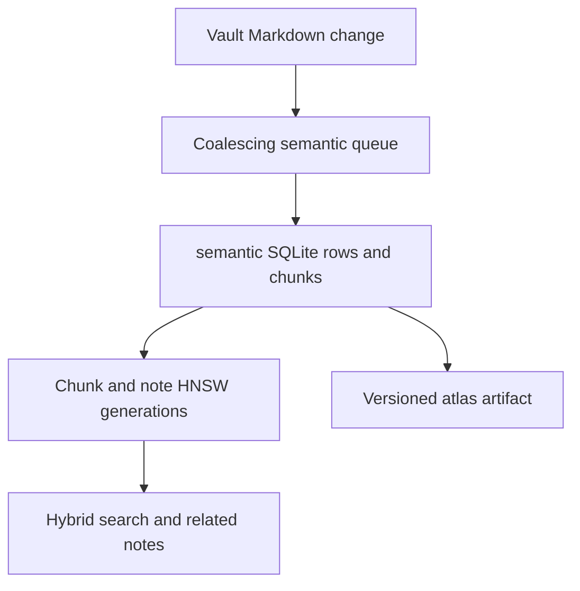

# Search, semantic indexing, related notes, and atlas

The system has separate planes: RAM Tantivy lexical/hybrid user search; semantic chunks and note vectors in vault-local SQLite/HNSW; related-note retrieval; persisted atlas artifacts; and policy-filtered AI retrieval. AI exclusions do not hide notes from the owner’s normal search, related panel, or atlas.

## Data and indexing lifecycle

`SemanticState::new_with_runtime` creates `<vault>/.gneauxghts/semantic.sqlite3` and cache while model files remain global app-data. SQLite uses WAL and `synchronous=NORMAL`. `semantic/db.rs` initializes/migrates tables for notes, chunks, vectors, embeddings, edges/edge dirty queue/generation, settings, index jobs, atlas positions, and label embeddings. Stable ANN labels survive moves. Semantic DB rows are authoritative semantic records; lexical Tantivy is `create_in_ram` and cache/lexical is reserved only.

Markdown chunks use title/heading/paragraph structure, roughly 480-character chunks with one paragraph overlap; long paragraphs use 360-character windows with 80 overlap. The local Jina v5 nano provider serves 768-dimensional vectors through local `llama-server`, uses Query/Document prefixes and batches 128. It has readiness timeout, child-exit/restart diagnostics, log rotation, and local-only actionable model errors.

Chunk and note cosine HNSW indexes use `M=16`, construction ef 200; search ef is 64/96. Immutable graph/vector/inventory generations publish by atomically flipping a manifest after sync. Startup validates schema, dimensions, tuning, capacity, and inventory; small changes reconcile incrementally, otherwise an older valid graph remains queryable but rebuild-pending. SQLite hydrates candidates, then exact cosine reranks with 0.18 threshold, so ANN determines candidates rather than final score/order. Interrupted `running` jobs become `interrupted`; worker retries are bounded at three and newer mutation work wins over old retries.

## Hybrid search and related notes

There are two related command paths. `search_notes_hybrid` is the owner-facing interactive path: it validates request inputs/current path, resolves a current draft and request cache fingerprint (query, limits/current identity/draft hash/index-relevant inputs), uses a six-entry draft cache, and can ask frontend to retry a `draft-cache-miss` with markdown. `services/retrieval.rs::retrieve_vault_notes` is the shared policy-aware retrieval helper used by agent/interactive callers that need an allowed-ID, excluded-ID, or modified-time boundary. It normalizes terms, clamps limits, builds lexical candidates from the in-memory note index, and applies document-kind, allowed/excluded ID, and modified-time filters in both lexical and semantic candidate paths.

Tantivy indexes paragraphs and boosts filename/title/section; unsaved current note is independently searched/merged. Semantic work requires enabled setting and query at least six normalized chars or two terms. Semantic failures preserve lexical output, report degraded status, then all candidates are deduplicated, merged, deterministically sorted by blended score/tie fields, and truncated. The interactive endpoint filters final results to ordinary `DocumentKind::Note`; policy-aware agent retrieval additionally applies conversation scope/exclusions. Hybrid results normalize lexical/semantic candidate maxima and add structural/access score.

Related panel requests only when open, deduplicates/cancels stale requests, and exposes unavailable/insufficient/no-match states. Full-note related lookup prefers fresh durable edges with disk/index hash equality, then note ANN, then chunk query; selection always uses chunk query. Minimum content is 80 whole note / 48 selection, query text max 1600 chars, and result cache keys index revision.

Edges use mean note embeddings: up to six neighbors, min cosine 0.42, provenance tied to note-ANN generation/model/algorithm. Changed notes mark neighbors dirty; small repair batches use current durable note ANN, otherwise rebuild. Note mutations enqueue dirty semantic work rather than making derived artifacts canonical: the indexer coalesces newer work, marks interrupted jobs, retries bounded failures, and chooses incremental repair only below the dirty-count/edge threshold; threshold overflow forces a full fallback while an older valid ANN remains queryable. ANN and note-ANN startup validates manifests and can recover small SQLite deltas; unsafe or incompatible artifacts become rebuild-pending/degraded. Focused tests cover dirty-edge threshold, ANN SQLite-delta recovery, note-ANN startup recovery, interrupted jobs, and queue coalescing. Semantic self-exclusion removes the current note from neighbor candidates; AI policy exclusion is applied later by retrieval and does not remove Markdown or owner-facing search results.

## Atlas

`get_vault_atlas` serves a compatible published atlas or queues background generation while retaining last-good stale output. Generation combines visible semantic metadata/vectors, k-NN, wikilinks, Leiden clusters, UMAP, cached positions, and separate progressive label artifacts. Compatibility includes source/visibility/input hash, ANN/edge generation, algorithm versions, and index revision. `Hidden` has ordinary notes; `Remembered` adds chat index docs; `All` excludes chat transcripts. `search_vault_atlas` scans visible atlas vectors directly—not ANN—and blends semantic, lexical, structural, recency, frequency; missing query embedding degrades to other signals.

## Exclusions and scope

Task/UI hidden notes are presentation state. Chat exclusions persist by stable note ID in `ai.sqlite3`, cancel active AI requests on policy change, and filter both AI lexical and semantic retrieval in `services/retrieval.rs`. User search/related/atlas receive no AI policy input, by design/scope.

## Startup health and recovery

`SemanticState` reports fresh, working, stale, degraded, and paused conditions; `SemanticHealth::legacy_recovery_state` maps these to compatibility recovery states for older UI consumers. Startup validates SQLite schema and ANN manifests, recovers small deltas where inventory and dimensions prove safety, and otherwise retains the last valid artifact while marking rebuild-pending/degraded. The focused `initialize_recovers_small_sqlite_delta_without_full_rebuild` and `startup_recovers_small_sqlite_delta` tests establish the ANN and note-ANN paths; these are not crash-injection black-box tests.

## Tests and validation

Read tests in `semantic/chunking.rs`, `lexical.rs`, `ann_core.rs`, `db.rs`, `indexer.rs`, `atlas.rs`, `related.rs`, plus TS search/related/atlas stores. They cover chunking, labels/moves, queue coalescing/retries, artifacts, edges and UI request races. No discovered live llama-provider full lifecycle integration, ANN crash/restart black-box, explicit exclusion-boundary test, or enforced performance benchmark. Use `cargo test --manifest-path src-tauri/Cargo.toml semantic` and `pnpm test -- src/lib/features/atlas` as narrow checks. IPC mechanics are [here](../architecture/ipc-events-contract.md).