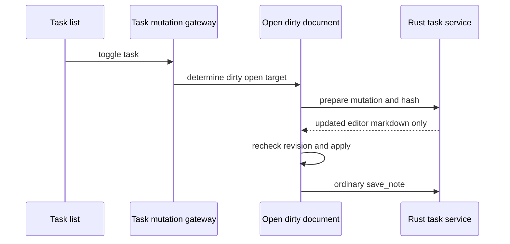

# Tasks, navigation, and wikilinks

Tasks are not an independent canonical database. Markdown checkboxes are the user-facing source of truth; `state/task_projection.rs` derives stable projected task rows in vault-local `app-state.sqlite3`. The List screen (`src/routes/list/+page.svelte`) groups/filter/searches these rows and can hide, collapse, reorder note groups, or hide individual tasks as presentation state.

## Mutation paths

`taskListStore.svelte.ts` calls `taskMutationGateway.ts`. For a clean or unopened document, Rust `toggle_task`/`delete_task` in `services/task_mutation.rs` finds a stable `task_id`, transforms the canonical line, atomically writes Markdown, then invokes the same post-commit catalog/task/semantic pipeline as note saves. It emits `vault-note-changed` with `source: taskMutation` so open editors refresh.

For a dirty open note, the gateway selects `openDocumentTaskMutation.ts`: `prepare_task_document_mutation` receives task ID, mutation kind, working markdown, and lowercase UTF-8 SHA-256 body hash. Rust validates the hash and unambiguous target but does not write. The frontend detects state changes while awaiting preparation, applies to the live document only if still current, and ordinary-saves. This prevents a backend task mutation from overwriting unsaved editor text.

## Navigation and links

`notepad/navigation/*`, `noteNavigation.ts`, and `taskNavigation.ts` coordinate route-to-editor opening. Search and task targets wait for editor paint; line range wins, with section/block fallback. Location MRU supports note/chat back navigation. Wikilink parsing/autocomplete/runtime live in `notepad/wikilinks/*`; Rust `resolve_note_link` and `autocomplete_note_links` provide vault-backed resolution through the IPC contract.

## Scope distinction

`hidden_note_ids` and task hidden/collapsed/order state control task/recent presentation. They do not mean AI exclusion and do not filter ordinary search, related notes, or atlas. AI note exclusions live in `ai.sqlite3` and apply to AI retrieval only; see [thought partner](ai/thought-partner.md).

## Tests and validation

`openDocumentTaskMutation.test.ts`, task store tests, `state/task_projection.rs` tests, `services/task_mutation.rs` tests, and navigation/wikilink tests are focused evidence. Run `pnpm test -- src/lib/features/tasks` for UI logic and `cargo test --manifest-path src-tauri/Cargo.toml task` for Rust work. See [document workspace](notepad/document-workspace.md) for the dirty-buffer concurrency guard and [vault persistence](vault/persistence-and-recovery.md) for atomic write limitations.