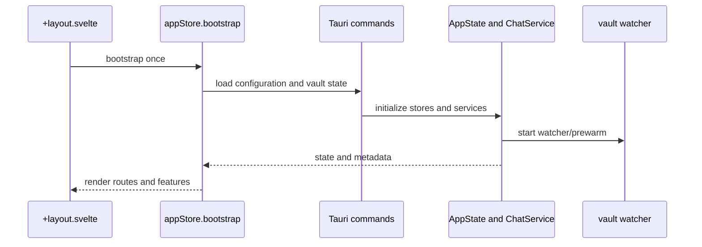
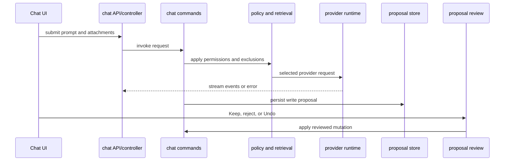

# End-to-end workflows

These traces are the shortest route through the repository when a change crosses the Svelte–Tauri boundary. Frontend stores and controllers initiate commands; Rust services own filesystem, database, provider, and watcher side effects; events and refreshed projections return derived state to Svelte.

## Startup and vault switching

Startup is ordered around backend initialization. A vault switch must replace the active vault context and its derived services rather than merely changing a preference; failures must leave the prior usable state or expose an error, not claim that the new vault is ready. See [shell/settings](../shell/settings.md) and [vault persistence](../vault/persistence-and-recovery.md).

## Edit, autosave, and external changes

The Notepad document runtime keeps editor state separate from the Markdown commit. User edits mark the document dirty; the editing service queues persistence through the session adapter and `save_note`. The watcher reports external file changes. The external-sync reducer/controller compares those changes against local dirty state: a clean document can reconcile, while a dirty document enters conflict handling so an external change cannot silently overwrite local edits. Rename and forget/restore use the same backend mutation boundary and refresh document identity/projections after success. Details live in [document workspace](../notepad/document-workspace.md).

## Tasks

A checkbox is derived into the task projection. A toggle from a clean document can call the task mutation command directly; a dirty open document routes through the document mutation adapter so the Markdown edit and editor state remain coordinated. Successful mutation invalidates or refreshes the projection and navigation target. Failed writes must remain visible as failed rather than updating the UI as if the checkbox persisted. See [tasks and navigation](../tasks-and-navigation.md).

## Search and indexing

Lexical lookup is immediate in-memory indexing; semantic indexing persists authoritative rows in SQLite and rebuildable ANN artifacts. Background work can be interrupted, invalidated, or retried. Retrieval consumers should use the current index version and exclusion policy rather than treating an ANN artifact as canonical. See [semantic search and atlas](../search/semantic-and-atlas.md).

## Chat and reviewed writes

Provider selection is explicit and local requests do not silently fall back to hosted providers. Tool reads and retrieval are policy-filtered; AI-generated mutations become proposals and require review before application. Cancellation and provider failures terminate the request path without turning an unreviewed proposal into a note write. Canonical ownership is in [the thought partner](../ai/thought-partner.md).

## Failure boundary checklist

When changing a flow, identify which state is durable (Markdown, app-state SQLite, semantic/AI databases) and which is derived (frontend projections, lexical index, ANN artifacts). Test the handoff at both sides of each IPC command, event payload compatibility, cancellation/error behavior, and recovery after interruption. The [IPC contract](../architecture/ipc-events-contract.md) records the shared change surface; [development and testing](../operations/development-and-testing.md) lists narrow validation commands.
